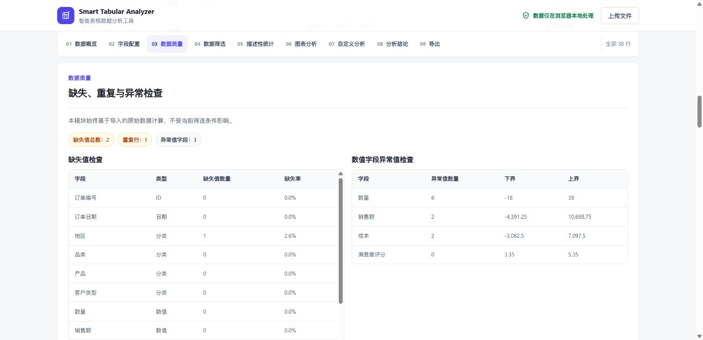

# Smart Tabular Analyzer

> A browser-based CSV and Excel analysis tool for fast, privacy-friendly exploration of structured data.

**Current release:** v2.1.0

## Language

English | [中文](./README.zh-CN.md)

## Live Demo

- **Live Demo:** [Open Smart Tabular Analyzer](https://wy-data-30.github.io/smart-tabular-analyzer/)
- **Repository:** [github.com/wy-data-30/smart-tabular-analyzer](https://github.com/wy-data-30/smart-tabular-analyzer)

Open the demo and choose **使用示例数据** ("Use Sample Data") to complete an analysis without preparing a file.

## About

Smart Tabular Analyzer helps users understand structured files with unfamiliar or inconsistent schemas. After a CSV or Excel file is selected, the application previews the data, infers field types, checks common data quality issues, calculates statistics, renders charts, supports filtered and grouped analysis, produces data-grounded observations, and exports results.

The project is a static website with no backend service, database, account system, or build step. It does not require fixed column names.

## Core Features

- Import CSV, `.xlsx`, and `.xls` files, including multi-sheet workbook selection, Chinese field names and values, and CSV encoding options for Auto Detect, UTF-8, GBK, and GB18030.
- Preview the first 10 rows and summarize the dataset size, field composition, missing values, and duplicate rows.
- Infer Numeric, Categorical, Date, and ID fields, with manual correction to Numeric, Categorical, Date, ID, or Ignore when needed.
- Report missing values and rates, complete duplicate rows, IQR-based numeric outliers, and numeric or date conversion failures.
- Generate descriptive statistics, categorical Top 10 frequencies, numeric distributions, and date trends.
- Apply categorical, numeric, and date filters; run grouped analysis; or use scenario templates for common structured datasets.
- Produce data-grounded observations without inferring external business context.
- Export filtered or deduplicated rows to CSV in the browser while preserving field order and neutralizing spreadsheet-formula prefixes.
- Export the analysis as HTML or Markdown; HTML reports embed the currently rendered charts for offline viewing.

Detailed processing rules and data flows are documented in [Architecture](./docs/ARCHITECTURE.md).

## Screenshots

### Home

Upload CSV or Excel files, or start immediately with the built-in sample data.


### Data Quality

Review missing values, duplicate rows, and IQR-based numeric outliers in one view.



### Analysis Results

Compare numeric distributions, categorical Top 10 results, and date trends through interactive charts.


## Privacy

CSV and Excel parsing, filtering, analysis, processed-data export, and report generation run locally in the browser. The application does not upload or store user files or generated reports. It does not send dataset contents to a third-party API or require an account.

The page loads pinned versions of PapaParse, Chart.js, and SheetJS from CDN providers and verifies them with Subresource Integrity (SRI). The browser contacts these CDN hosts when loading the page, but uploaded file contents remain in the browser runtime.

## Tech Stack

- HTML5
- CSS3
- Vanilla JavaScript
- [PapaParse 5.4.1](https://www.papaparse.com/) for CSV parsing
- [Chart.js 4.4.1](https://www.chartjs.org/) for data visualization
- [SheetJS 0.20.3](https://sheetjs.com/) for Excel workbook parsing

## Quick Start

### Use the Live Demo

1. Open the [Live Demo](https://wy-data-30.github.io/smart-tabular-analyzer/).
2. Choose **使用示例数据** ("Use Sample Data"), or upload a `.csv`, `.xlsx`, or `.xls` file.
3. Review the inferred field types, correct them only when needed, and use the analysis navigation to explore or export the results.

### Run Locally

Clone the repository and start a static server:

```bash
git clone https://github.com/wy-data-30/smart-tabular-analyzer.git
cd smart-tabular-analyzer
python -m http.server 8000
```

Then open:

```text
http://localhost:8000
```

Opening `index.html` directly also works for file uploads, but a local server is recommended because some browsers restrict the sample-data `fetch()` request on `file://` pages.

## Testing and CI

The automated tests require Node.js 18 or later and use the built-in `node:test` runner without test dependencies.

Run the focused core data-processing suite:

```bash
npm test
```

Run the full import, export, report, boundary, and HTML integration regression suite:

```bash
npm run test:regression
```

[GitHub Actions CI](./.github/workflows/ci.yml) runs the full regression suite with Node.js 22 on every push and pull request. See the [Testing Guide](./docs/TESTING.md) for suite coverage and troubleshooting.

## Documentation

- [Architecture](./docs/ARCHITECTURE.md): architecture, state, import, field inference, filtering, analysis, charts, and export data flows.
- [Testing Guide](./docs/TESTING.md): test commands, suite coverage, fixture guidance, and common failures.
- [Maintenance Guide](./docs/MAINTENANCE.md): core invariants, dependency updates, deployment, and troubleshooting.
- [Release Checklist](./docs/RELEASE_CHECKLIST.md): automated and manual checks used before publication.

### Project Structure

```text
.
├── index.html
├── style.css
├── script.js
├── examples/
│   ├── sample-data.csv          # Loaded by "Use Sample Data"
│   ├── sample-sales.csv
│   ├── sample-students.csv
│   ├── sample-survey.csv
│   ├── sample-used-products.csv
│   └── sample-user-behavior.csv
├── assets/
├── docs/
├── tests/
└── package.json
```

## Known Limitations

- Each import is limited to 25 MB, 100,000 data rows, and 200 columns.
- Parsing and analysis run on the browser main thread and may temporarily block the interface near the import limits, especially on mobile devices.
- Field inference is heuristic, and strict date parsing may require manual confirmation for ambiguous columns.
- Excel worksheets must have unique, non-empty text headers in the first non-empty row; empty, headerless, protected, or structurally irregular worksheets may be rejected.
- The project focuses on basic exploratory analysis rather than advanced data cleaning, forecasting, or machine learning.
- Analysis results are not persisted; refreshing the page clears the current analysis.
- CDN dependencies require network access unless the libraries are hosted locally.

## License

This project is licensed under the MIT License. See [LICENSE](./LICENSE).
