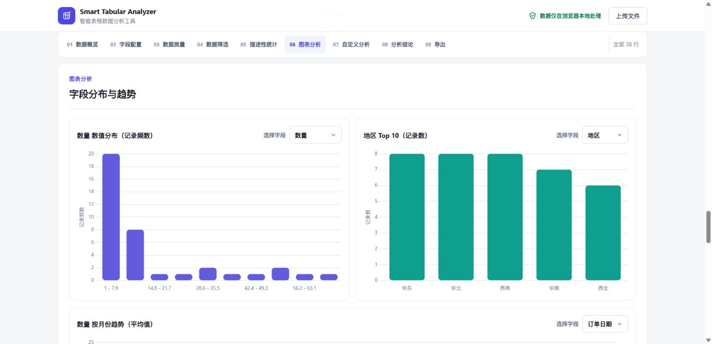

# Smart Tabular Analyzer

**Current version:** V2.1

**Chinese name:** 智能表格数据分析工具

**Subtitle:** Browser-based CSV and Excel data analysis tool

**Repository:** [github.com/wy-data-30/smart-tabular-analyzer](https://github.com/wy-data-30/smart-tabular-analyzer)

**Live Demo:** [Open Smart Tabular Analyzer](https://wy-data-30.github.io/smart-tabular-analyzer/)

[中文说明](./README.zh-CN.md)

Smart Tabular Analyzer is a browser-based CSV and Excel data analysis tool for quick exploration of structured data files. After a user uploads a file, the application performs data preview, field type detection, data quality checks, descriptive statistics, chart generation, custom grouping analysis, and basic insight generation entirely in the browser.

The project is built as a static website and does not require a backend service, database, account system, or build step.

## Screenshots

### Upload Workspace


### Analysis Workspace



## Features

- Upload and parse CSV files in the browser.
- Import `.xlsx` and `.xls` workbooks with SheetJS. Single-sheet files enter analysis directly; multi-sheet files show a worksheet selector first.
- Protect browser responsiveness with an import limit of 25 MB, 100,000 data rows, and 200 columns.
- Select CSV file encoding manually, including Auto Detect, UTF-8, GBK, and GB18030.
- Preview the first 10 rows of the dataset.
- Automatically identify numeric, categorical, date, and ID fields, with semantic handling for student/record identifiers and year columns.
- Review a field configuration table containing the field name, inferred type, non-empty count, unique count, and sample values.
- Stage field type corrections as Numeric, Categorical, Date, ID, or Ignore, then apply them in one batch to rebuild statistics, trends, charts, and insights.
- Report non-empty values that cannot be safely converted to the selected numeric or date type, while continuing with valid values.
- Restore all fields to automatic detection at any time.
- Generate a dataset overview, including row count, field count, field type counts, missing values, and duplicate rows.
- Filter the current analysis by multiple categorical values, a numeric range, and an optional date range at the same time, without modifying the imported rows.
- Produce data quality reports for missing values, missing rates, duplicate rows, and numeric outliers.
- Calculate descriptive statistics for numeric fields, including mean, median, minimum, maximum, and standard deviation. Columns consistently written with `%` keep decimal values internally but are displayed as percentages in statistics and charts.
- Generate frequency statistics for categorical fields, including Top 10 categories and proportions.
- Render charts for numeric distributions, categorical Top 10 values, and date trends.
- Support custom analysis by selecting a numeric metric, a categorical grouping field, and an optional date field.
- Provide scenario templates for general data, sales data, student scores, used product prices, surveys, and user behavior logs.
- Generate cautious, data-based insights without assuming external business context.
- Export the current filtered rows or the original dataset with complete duplicate rows removed as CSV. Data exports preserve the original field order and include a UTF-8 BOM for Excel compatibility.
- Export the completed analysis as an HTML or Markdown report. Both formats include source metadata, field types, data quality, statistics, trends, custom grouping results, and automatic insights.
- Preserve the currently rendered charts inside a self-contained HTML report that can be opened offline.
- Support responsive layouts for desktop and mobile screens.

## Tech Stack

- HTML5
- CSS3
- Vanilla JavaScript
- [PapaParse](https://www.papaparse.com/) for CSV parsing
- [Chart.js](https://www.chartjs.org/) for data visualization
- [SheetJS](https://sheetjs.com/) for Excel workbook parsing

External libraries are loaded through CDN links in `index.html`.

## Project Structure

```text
.
├── index.html
├── style.css
├── script.js
├── assets/
├── package.json
├── tests/
│   ├── data-processing.test.cjs
│   ├── basic-data-processing.test.cjs
│   ├── core.test.cjs
│   ├── test-context.cjs
│   └── fixtures/
├── sample-data.csv
├── sample-sales.csv
├── sample-students.csv
├── sample-used-products.csv
├── sample-survey.csv
├── sample-user-behavior.csv
├── LICENSE
├── README.md
└── README.zh-CN.md
```

## Getting Started

You can open `index.html` directly in a browser.

For the best local experience, start a static server from the project directory:

```bash
python -m http.server 8000
```

Then visit:

```text
http://localhost:8000
```

Using a local static server is recommended because some browsers restrict `fetch()` when opening files directly from the local filesystem. This can affect the "Load Sample Data" button.

## Running Tests

The automated test suite requires Node.js 18 or later and uses only the built-in `node:test` runner. No test dependency installation is required. The default release gate is:

```bash
npm test
```

This command runs the focused core data-processing suite. It covers numeric, percentage, currency and date parsing; field and ID inference; missing and duplicate rows; descriptive statistics; IQR outliers; filters; deduplication; Chinese fields; and boundary datasets. It intentionally does not assert CSS implementation details.

Run the same core suite directly when `npm` is unavailable:

```bash
node --test tests/data-processing.test.cjs
```

Run the broader import, export, report, and HTML integration regression suite with:

```bash
npm run test:regression
```

## Usage

1. Open the application in a browser.
2. For CSV files, select the encoding if needed. Use Auto Detect by default, or choose UTF-8, GBK, or GB18030 explicitly.
3. Upload a `.csv`, `.xlsx`, or `.xls` file by selecting it or dragging it into the upload area.
4. If an Excel workbook contains multiple worksheets, choose one and click **Analyze selected worksheet**. A single-sheet workbook enters analysis directly.
5. Review the field configuration table. Correct any type as Numeric, Categorical, Date, ID, or Ignore, then click **Apply field configuration**.
6. Check the conversion failure count. Invalid non-empty numeric or date values are skipped from the corresponding analysis instead of stopping the import.
7. Use **Restore automatic detection** to discard manual type corrections and rebuild the analysis from the inferred types.
8. Review the generated data overview, quality report, statistics, charts, and insights.
9. Optionally apply categorical, numeric, and date filters to define the current analysis range.
10. In **Export Data**, download either the current filtered rows or the original dataset with complete duplicate rows removed.
11. Use the field selectors or a scenario template for custom analysis.
12. After analysis finishes, use **Export HTML report** or **Export Markdown report** in the report navigation. The report export controls remain disabled until a valid analysis is available.

The application does not require fixed column names. Template analysis is based on the fields selected by the user.

The encoding selector applies to CSV files. If Chinese CSV headers or values are displayed incorrectly, try `GBK` or `GB18030`, or export the file as `CSV UTF-8` from Excel/WPS. Excel workbooks are decoded by SheetJS and preserve Chinese worksheet names, headers, and cell values.

## Sample Data

The repository includes sample CSV files for testing different analysis scenarios:

- `sample-data.csv`: general order-style data for testing the full analysis workflow.
- `sample-sales.csv`: sales data for testing amount, unit price, quantity, category, region, and date trend analysis.
- `sample-students.csv`: student score data for testing score distribution, class/subject grouping, and exam date trends.
- `sample-used-products.csv`: used product price data for testing price distribution, platform, city, condition, and price outliers.
- `sample-survey.csv`: survey data for testing satisfaction, age, gender, city, and choice frequency analysis.
- `sample-user-behavior.csv`: user behavior data for testing user IDs, events, channels, devices, and event time trends.

The sample files use UTF-8 BOM encoding and include Chinese field names and values. They also contain a small number of missing values, duplicate rows, and outliers to help verify the data quality checks.

`tests/fixtures/excel-import-test.xlsx` is a multi-sheet Excel regression fixture containing Chinese worksheet names and values, plus empty-sheet and missing-header cases.

`tests/fixtures/field-inference-edge-cases.csv` covers common inference edge cases: numeric student IDs, semantic year columns, currency-formatted prices, percentages, mixed date formats, conflicting day/month formats, and high-uniqueness record numbers.

## Supported Data Types

- Numeric fields: values such as amount, quantity, score, price, duration, and rate.
- Categorical fields: values such as region, category, city, channel, device, gender, and subject.
- Date fields: strictly validated values such as `2025-01-01`, `2025年1月2日`, or `13/01/2025`. Semantic year columns such as `年份` are also treated as date fields and grouped by year.
- ID fields: identifiers such as order IDs, user IDs, student IDs, event IDs, codes, and primary keys.

## Field Detection Rules

For each column, the application calculates non-empty count, unique count, uniqueness ratio, numeric match ratio, and date match ratio. Field types are detected with the following heuristic rules:

- ID field: the field name contains keywords such as `id`, `uuid`, `code`, `key`, `number`, `no`, `编号`, `编码`, `订单号`, `账号`, `工号`, `学号`, `学籍号`, `考生号`, `准考证号`, `设备号`, or `主键`; or the column has a very high uniqueness ratio and is not primarily numeric or date-like. Numeric student/record numbers are therefore kept out of arithmetic statistics, while unrelated fields such as `学号数量` remain numeric.
- Date field: at least 80% of non-empty values can be parsed by the strict date converter. Mixed year-first, Chinese year-month-day, and day-first/month-first values are supported when the column contains unambiguous evidence for the day/month order. If both orders conflict, only unambiguous cells are converted and ambiguous cells are counted as failures.
- Semantic year field: names such as `年份`, `年度`, `学年`, `财年`, `入学年`, `毕业年`, or a corresponding English year token may use four-digit values from 1900 through 2200 and are grouped with `YYYY` labels. An unrelated four-digit numeric column is not promoted to a date merely because its values look like years.
- Numeric field: at least 80% of non-empty values can be parsed as numbers.
- Numeric formatting: currency symbols and thousands separators are removed for calculation. A column is displayed as a percentage only when all safely convertible non-empty numeric values use `%`; mixed percent and plain-decimal columns keep ordinary numeric formatting.
- Categorical field: used as the default type when none of the rules above apply.

Field detection is heuristic. Users can correct inferred types in the field configuration table before continuing with custom selectors or scenario template mappings.

## Field Type Confirmation

- Type selections are staged first and do not change the current analysis until **Apply field configuration** is clicked.
- Applying a configuration rebuilds descriptive statistics, categorical frequencies, date trends, charts, field selectors, scenario mappings, and automatic insights through the same shared analysis pipeline.
- Numeric and date conversions reuse the same strict converters as the analysis. Missing values are not conversion failures; non-empty invalid values are counted and skipped.
- Ignored fields remain visible in the raw preview and data quality report, but are excluded from statistics, trends, charts, scenario mappings, and automatic insights.
- Restoring automatic detection clears every manual override without reparsing the source file.

## Data Quality Rules

- Missing values: empty strings, `null`, `undefined`, and whitespace-only values are treated as missing.
- Missing rate: calculated as missing values divided by total row count for each column.
- Duplicate rows: detected by comparing the exact original values across all fields in each row. Leading or trailing spaces remain significant.
- Numeric outliers: detected with the IQR method. Values below `Q1 - 1.5 * IQR` or above `Q3 + 1.5 * IQR` are marked as outliers.
- Empty input handling: CSV files and Excel worksheets without a usable header row or valid data rows show a clear error message and do not keep stale analysis results on screen.

## Charts

- Numeric distribution chart: displays numeric values as a histogram.
- Categorical Top 10 chart: displays the 10 most frequent categories as a bar chart.
- Date trend chart: aggregates record counts or numeric values by date and displays a line chart.
- Custom grouping chart: groups a selected numeric metric by a selected categorical field.
- Scenario template charts: render a primary chart, secondary chart, and optional trend chart based on the selected template and field mapping.

## Processed Data Export

The **Export Data** section provides two browser-local CSV downloads:

- **Filtered CSV:** exports the current `filteredRows` result. When no filter is active, it contains all imported rows.
- **Deduplicated CSV:** removes complete duplicate rows from the original imported dataset across all original fields and retains the first occurrence of each row. Comparison uses exact original cell values, so leading or trailing spaces remain significant. This export is independent of the current filters.

Both exports preserve the original column order and cell values. Files are generated with comma delimiters, CRLF line endings, and a UTF-8 BOM so that Chinese headers and values open correctly in Excel and WPS. File names follow `original_filtered_YYYYMMDD.csv` or `original_deduplicated_YYYYMMDD.csv`, for example `sales_filtered_20260718.csv`.

Exporting creates a new browser download. It does not modify or overwrite the uploaded CSV or Excel file, and no source rows are sent to a server.

## Report Export

V2.1 can download the current analysis as either a standalone HTML file or a Markdown file. Report generation and download happen entirely in the browser; source rows and report contents are never uploaded.

Both formats include:

- Original file name and, for Excel imports, the selected worksheet name.
- Analysis time and dataset size (row and field counts).
- Applied field type results, including ignored fields and conversion failure counts where applicable.
- Data quality summary, per-field missing values, duplicate rows, and numeric outlier results.
- Descriptive statistics for available numeric fields.
- Top 10 values for available categorical fields.
- A summary of available date trends.
- The current custom grouping analysis result, when a valid metric/group selection is available.
- Automatically generated analysis conclusions.

The HTML report embeds the currently rendered charts and its required presentation styles in the downloaded file, so the report itself can be opened without a network connection. The Markdown export is a portable text report and represents analytical results as headings, lists, and tables.

Downloaded files use the original file base name plus the local export date and time, for example `sales-20260717-153045.html` or `sales-20260717-153045.md`. For empty or invalid input, analysis does not complete and both buttons stay unavailable. If a valid dataset has no numeric, categorical, date, or custom grouping result, the report records that no applicable fields or results are available instead of failing.

## Project Highlights

- Static, browser-only architecture suitable for GitHub Pages and other static hosting platforms.
- No fixed business schema; CSV files with different structures can be analyzed through automatic detection and manual field mapping.
- Privacy-friendly processing because uploaded files are parsed locally in the browser.
- Practical coverage of the common CSV exploration workflow: preview, schema detection, quality checks, statistics, visualization, and insights.
- Browser-local export of filtered or deduplicated rows with Excel-compatible UTF-8 CSV encoding.
- Built-in scenario templates for common structured datasets.
- Responsive interface with scrollable tables and adaptive chart layouts.
- Supports Chinese field names and values in CSV and Excel files.

## Privacy

All CSV and Excel parsing, filtering, processed data export, analysis, and report export run locally in the browser. The application does not upload data files or generated reports to a server, store user files, or send dataset contents to a third-party API.

The page loads PapaParse, Chart.js, and SheetJS from CDN providers. When the page loads these external scripts, the browser may request resources from the CDN host, but uploaded data files remain local to the browser runtime.

## Known Limitations

- Each import is limited to 25 MB, 100,000 data rows, and 200 columns to protect browser responsiveness. Files above these limits must be split before import.
- Date parsing uses strict format validation. Ambiguous month/day cells require a consistent order inferred from other unambiguous cells in the same column; conflicting evidence leaves those ambiguous cells unconverted and reports them in the field configuration table.
- Excel analysis expects the first non-empty row of the selected worksheet to contain unique, non-empty text headers. Headerless, empty, protected, or structurally irregular worksheets may be rejected with an error.
- Field type detection is based on heuristic rules and may require manual confirmation for ambiguous columns.
- A manually selected numeric or date type does not rewrite source values; values that fail strict conversion are excluded from that type's analysis and shown in the failure count.
- The project focuses on basic exploratory analysis and does not include advanced data cleaning, forecasting, or machine learning.
- Analysis results are not persisted. Refreshing the page clears the current analysis.
- CDN dependencies require network access unless the libraries are downloaded and referenced locally.

## Roadmap

- Add chunked parsing and progress indicators for large CSV files.
- Improve encoding and delimiter detection.
- Add batch chart image export and richer report themes.
- Add more chart types such as box plots, scatter plots, and stacked bar charts.
- Add sorting, field renaming, derived fields, and simple data cleaning operations.
- Add saved analysis configurations.
- Continue splitting core analysis logic into smaller modules and expand automated regression coverage.

## License

This project is licensed under the MIT License. See [LICENSE](LICENSE) for details.
