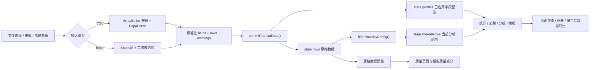

# Smart Tabular Analyzer v2.1.0 架构说明

本文描述当前发布版本的实际实现，而不是未来目标架构。它面向维护者，用于在不重构 `script.js` 的前提下理解状态、导入、分析、渲染和导出之间的关系。

## 架构概览

Smart Tabular Analyzer 是一个无后端、无数据库、无构建步骤的静态浏览器应用：

- `index.html` 定义页面结构，并从 CDN 加载 PapaParse、Chart.js 和 SheetJS。
- `style.css` 提供桌面端与移动端样式。
- `script.js` 包含应用状态、事件绑定、文件解析、分析计算、图表、页面渲染和导出逻辑。
- CSV、Excel、筛选、统计和报告生成均在浏览器本地完成。
- 当前导入上限由 `IMPORT_LIMITS` 统一控制：25 MB、100,000 行数据、200 列。

| 外部依赖 | 当前职责 | 代码访问方式 |
| --- | --- | --- |
| PapaParse | CSV 解析和 CSV 导出序列化 | `window.Papa` / `Papa` |
| SheetJS | `.xlsx` / `.xls` 工作簿解析 | `window.XLSX` / `XLSX` |
| Chart.js | 页面图表和报告图表快照 | `window.Chart` / `Chart` |

## 文件结构

```text
.
├── index.html                  # 页面结构、控件和 CDN 引用
├── style.css                   # 页面样式与响应式规则
├── script.js                   # 全部浏览器端应用逻辑
├── package.json                # Node 测试命令
├── examples/
│   └── sample-*.csv            # 内置与手工测试用虚构数据
├── assets/                     # README 截图
├── tests/
│   ├── test-context.cjs        # VM + 轻量假 DOM 测试环境
│   ├── data-processing.test.cjs
│   ├── basic-data-processing.test.cjs
│   ├── destructive-qa.test.cjs
│   ├── core.test.cjs
│   └── fixtures/               # 手工回归夹具
├── docs/                       # 开发者维护文档
└── .github/workflows/ci.yml    # push / PR 自动回归测试
```

## 核心数据流



当前实现依赖以下不变量：

1. `state.rows` 是导入后原始数据的事实来源；筛选和去重不得改写它。
2. 普通分析统一通过 `getAnalysisRows()` 读取当前范围。
3. 质量页始终基于原始 `state.rows`；筛选不会改变缺失、重复和异常值口径。
4. 字段类型修正只更新 profile，不改写原始单元格；转换发生在统计时。
5. 每次新导入必须通过 `beginImport()` 生成新的导入 ID，旧异步结果不得提交。
6. Chart.js 实例创建前必须销毁旧实例，全部实例统一登记在 `state.charts`。
7. 报告只有在分析完成且没有未应用字段类型草稿时才能导出。

## 1. Application State（应用状态）

**主要职责**

- 保存当前唯一数据集、字段顺序、字段画像、筛选结果、统计缓存、图表实例和来源元信息。
- 隔离连续导入产生的异步回调。
- 维护“原始数据质量”与“当前筛选分析”两个不同的数据范围。
- 为所有 renderer、图表和导出流程提供共享状态。

`state` 是当前唯一的应用级可变状态，主要字段按职责分组如下：

| 状态分组 | 字段 | 含义 |
| --- | --- | --- |
| 原始数据 | `rows`, `fields` | 完整原始记录和固定字段顺序 |
| 当前分析范围 | `filteredRows`, `filterSourceRows`, `filters` | 当前筛选结果、来源身份保护和已应用条件 |
| 字段配置 | `profiles`, `fieldTypeDrafts` | 自动识别结果、已应用类型和未应用草稿 |
| 派生分析 | `numericStats`, `qualityNumericStats`, `categoryStats`, `insights`, `customAnalysis` | 当前统计、原始质量统计、结论和自定义分析快照 |
| 质量信息 | `duplicateRows`, `totalMissing`, `parseWarnings` | 原始数据重复、缺失和 CSV 解析警告 |
| 导入控制 | `pendingExcel`, `activeFileReader`, `activeImportId` | 多工作表等待状态、当前读取器和导入版本号 |
| 来源与完成状态 | `sourceFileName`, `sourceSheetName`, `sourceType`, `analysisCompletedAt` | 报告元信息和导出门禁 |
| 图表与筛选 UI | `charts`, `categoryFilterOptions`, `categoryFilterDraftValues` | Chart 实例及分类筛选草稿 |

**主要函数**

- `beginImport()`：递增 `activeImportId`、取消旧读取、清空旧分析并锁定导入控件。
- `isCurrentImport(importId)`：判断异步结果是否仍属于当前导入。
- `abortActiveFileRead()`：中止仍在运行的 `FileReader`。
- `commitTabularData(...)`：成功导入的统一提交点；写入状态、生成派生数据并触发首轮渲染。
- `getAnalysisRows()`：只有 `filterSourceRows === state.rows` 时才返回 `filteredRows`，否则回退到原始行。
- `refreshFilteredAnalysis()`：筛选后重算当前范围的统计、结论、图表和导出状态。
- `rebuildAnalysisFromProfiles()`：字段类型提交后清除筛选，并重建依赖字段类型的全部结果。
- `resetAnalysisState()`：销毁图表，同时清空领域状态和结果 DOM；不会把 `activeImportId` 重置为旧值。

**输入 / 输出**

- 输入：规范化后的 `{ fields, rows }`、导入元信息、用户筛选和字段配置操作。
- 输出：更新后的全局 `state`。大多数状态函数没有返回业务对象，而是通过状态和 DOM 副作用完成工作。
- `filteredRows = rows.slice()` 只复制数组；行对象仍与 `rows` 共享，因此下游必须保持只读。

**与其他模块的关系**

- 所有模块都直接或间接读取 `state`，它是当前单体脚本中耦合度最高的中心。
- File Input & Parsing 最终调用 `commitTabularData()`。
- Profiling、Statistics 和 Filtering 生成派生状态。
- Visualization、UI Rendering 和 Export 消费这些状态。

## 2. File Input & Parsing（文件输入与解析）

**主要职责**

- 接受文件选择、拖放和内置示例数据。
- 检查文件大小与扩展名，并路由到 CSV 或 Excel 流程。
- 管理完整文件读取和连续上传的并发隔离。
- 将不同输入统一为 `fields + rows`，再交给同一个提交入口。

**主要函数**

| 函数 | 职责 |
| --- | --- |
| `parseDataFile(file)` | 检查 25 MB 上限，按 `.csv`、`.xlsx`、`.xls` 后缀路由 |
| `parseCsvFile(file)` | 读取 CSV 编码选择、获取 `ArrayBuffer`、解码并进入 PapaParse |
| `parseCsvText(text, sourceName, importId)` | 以表头模式调用 PapaParse |
| `handleParsedData(results, sourceName, importId)` | 校验 PapaParse 结果，规范化字段和行 |
| `encodeCsvHeaderForParser()` / `decodeCsvHeaderFromParser()` | 用唯一内部键保护重复、空白及 `__proto__` 等特殊表头 |
| `normalizeFieldName()` / `normalizeParsedRow()` | 去除表头 BOM 和空格，并生成无原型行对象 |
| `readFileAsArrayBuffer(file, importId)` | 通过 `FileReader` 或 `file.arrayBuffer()` 读取完整文件 |
| `commitTabularData(...)` | 接收最终标准化数据并提交到应用状态 |

PapaParse 当前配置为：

- `header: true`
- `skipEmptyLines: true`
- `preview: 100001`
- `worker: false`

关闭 Worker 是有意行为：`transformHeader` 是函数，无法由 PapaParse Worker 克隆；保留主线程解析可以继续执行项目自己的特殊表头和重复表头检查。

`handleParsedData()` 的关键校验包括：

- 数据列多于表头时拒绝导入，避免额外单元格被静默丢弃。
- 缺失引号和有效的分隔符错误视为致命错误。
- 单列 CSV 的 `UndetectableDelimiter` 不作为错误。
- 表头去 BOM、去首尾空格后必须唯一。
- 空表头下存在数据时拒绝导入；完全空的尾列可忽略。
- 空数据行被过滤；最终必须至少有一个字段和一行数据。
- 非致命 PapaParse 问题最多保存 20 条到 `parseWarnings`。

**输入 / 输出**

- 文件入口输入浏览器 `File`；示例入口输入 `fetch("examples/sample-data.csv")` 返回的文本。
- CSV 解析的标准输出是 `fields: string[]`、无原型 `rows: object[]` 和可选 `parseWarnings`。
- 成功路径没有直接返回值，而是调用 `commitTabularData()`；失败路径通过 `showError()` 清空结果并显示错误。

**与其他模块的关系**

- CSV 文件先经过 CSV Encoding，再进入 PapaParse。
- Excel 文件交给 Excel Workbook Handling。
- 两条路径最终都进入 Application State。
- UI Rendering 负责文件事件、加载状态和错误展示。

当前解析是完整读取、完整解码、完整解析，不是流式处理；接近导入上限时会占用主线程和浏览器内存。内置示例直接使用 `response.text()`，不经过用户选择的 CSV 编码。

## 3. CSV Encoding（CSV 编码）

**主要职责**

- 将 CSV `ArrayBuffer` 解码为 PapaParse 可消费的字符串。
- 支持自动识别、UTF-8、GBK 和 GB18030。
- 为状态提示返回实际采用的编码标签。

**主要函数**

- `decodeCsvBuffer(buffer, selectedEncoding)`：编码入口，返回 `{ text, label }`。
- `autoDecodeCsvBuffer(buffer)`：执行自动识别策略。
- `hasUtf8Bom(buffer)`：检查 `EF BB BF`。
- `decodeText(buffer, encoding, fatal)`：封装浏览器 `TextDecoder` 并生成可读错误。

自动识别并不是统计式编码检测，实际顺序是：

```text
UTF-8 BOM
→ 严格 UTF-8 解码
→ 失败后按 GB18030 解码
```

手动选择 UTF-8、GBK 或 GB18030 时，直接使用对应的 `TextDecoder` 编码名。

**输入 / 输出**

- 输入：CSV 文件的 `ArrayBuffer` 和 `auto | utf-8 | gbk | gb18030`。
- 输出：`{ text, label }`。
- 不支持的编码值或浏览器不支持的解码器会抛出错误。

**与其他模块的关系**

- `parseCsvFile()` 负责读取 `dom.fileEncoding.value` 并调用本模块。
- 解码成功后把 `text` 交给 `parseCsvText()`。
- 本模块只负责字节到文本，不判断分隔符、表头或字段类型。

自动模式对非 UTF-8 字节统一回退到 GB18030，因此 Big5、Shift-JIS 等其他编码可能被错误解释。手动非严格解码也可能产生替换字符，这是当前实现边界。

## 4. Excel Workbook Handling（Excel 工作簿处理）

**主要职责**

- 验证并读取 `.xlsx` / `.xls` 工作簿。
- 单工作表直接分析，多工作表暂停并等待用户选择。
- 校验工作表范围、表头和数据行。
- 把 Excel 单元格转换为统一的字符串行对象。

**主要函数**

| 函数 | 职责 |
| --- | --- |
| `parseExcelFile(file)` | 读取文件、校验签名，并调用 `XLSX.read(..., { type: "array", cellDates: true })` |
| `validateExcelFileSignature(buffer, fileName)` | `.xlsx` 检查 ZIP `PK` 签名，`.xls` 检查 OLE 签名 |
| `showExcelSheetSelection(...)` | 把完整工作簿保存到 `state.pendingExcel` 并显示工作表下拉框 |
| `analyzeSelectedExcelSheet()` | 校验待选状态和当前选择 |
| `importExcelSheet(...)` | 校验 `!ref`、读取二维数组并提交所选工作表 |
| `validateExcelWorksheetLimits()` | 根据工作表使用区域预检 100,000 行和 200 列 |
| `buildExcelTabularData()` | 去除首尾空行、识别使用列、验证表头并生成 `{ fields, rows }` |
| `normalizeExcelCellValue()` | Date 转 `YYYY-MM-DD`，其他原始标量转字符串 |

`importExcelSheet()` 当前使用：

```js
XLSX.utils.sheet_to_json(worksheet, {
  header: 1,
  defval: "",
  raw: true,
  blankrows: true
})
```

生产调用把同一份 `rawRows` 同时传给 `buildExcelTabularData(formattedRows, rawRows)` 的两个参数；当前没有另外读取一份格式化显示值。

**输入 / 输出**

- 输入：Excel `File`；多工作表时还包括用户选择的 `sheetName`。
- 中间输出：SheetJS workbook 或 `state.pendingExcel`。
- 最终输出：唯一、非空文本字段数组，以及由无原型对象组成的行数组。
- Date 对象被规范为 UTC 日期字符串；string、number、boolean 和 bigint 被转成字符串。

**与其他模块的关系**

- File Input & Parsing 负责路由和读取。
- UI Rendering 管理工作表选择面板及错误状态。
- 成功选择后调用 `commitTabularData(..., sheetName)`，后续 profiling、统计和渲染与 CSV 完全共用。

当前一次只分析一个工作表，不合并多表。首个非空行必须是唯一、非空的文本表头；复杂标题区、合并单元格、数值表头或异常 `!ref` 可能被拒绝。整个工作簿保存在内存中，解析仍在主线程完成。

## 5. Field Profiling & Type Detection（字段画像与类型识别）

**主要职责**

- 基于原始行建立每列画像。
- 自动识别 `id`、`date`、`numeric` 或 `category`。
- 保存日期解析策略、数值格式和转换失败数量。
- 支持字段类型草稿、应用和恢复自动识别；`ignore` 只由用户选择。

**主要函数**

| 函数 | 职责 |
| --- | --- |
| `buildColumnProfile(field, rows)` | 生成完整 profile |
| `isIdFieldName(field)` | 根据英文边界、常见实体后缀和中文编号语义识别 ID 名称 |
| `buildDateStrategy(field, values)` | 从整列建立 none / DMY / MDY / conflict 和 year-only 策略 |
| `toDate(value, strategy)` / `buildUtcDate()` | 严格解析并验证真实日历日期 |
| `toNumber(value)` | 解析普通数值、科学计数、规范千分位、货币、会计负数和百分比 |
| `detectNumericFormat(values)` | 只有所有可转换值都带 `%` 时标记为 percent |
| `countFieldConversionFailures()` | 取得指定字段按数值或日期解释时的失败数量 |
| `stageFieldTypeChange()` | 只更新未应用草稿和提示 |
| `applyFieldConfiguration()` | 把草稿提交到 `profile.typeKey` 并触发重建 |
| `restoreAutomaticFieldTypes()` | 恢复 `inferredTypeKey` |

自动识别按以下优先级执行：

1. 字段名符合 ID 语义；或非空值至少 12 个、唯一率至少 98%，且数值率和日期率均低于 70%。
2. 日期转换成功率至少 80%。
3. 数值转换成功率至少 80%。
4. 其他字段归为分类。

唯一率、日期转换率和数值转换率都以非缺失值数 `nonMissingCount` 为分母；缺失值不计入转换失败。

每个 profile 包含：

- 字段名、自动类型和当前应用类型。
- 总数、非空数、缺失数和缺失率。
- 唯一值数量和唯一率。
- 数值率、日期率、日期策略和数值格式。
- 最多 3 个去重后的示例值。
- 数值与日期两种解释下的转换失败数。

**输入 / 输出**

- 输入：单个字段名和原始 `rows`。
- 输出：profile 对象。`buildColumnProfile()` 本身不写状态，由 `commitTabularData()` 汇总后写入 `state.profiles`。
- 人工类型修正只改变 profile；原始单元格不会被转换或覆写。统计时无法安全转换的非空值会被跳过。

**与其他模块的关系**

- `commitTabularData()` 为每个字段调用 `buildColumnProfile()`。
- Data Quality、Statistics、Filtering、Visualization 和模板字段选择都以当前已应用 `typeKey` 为准。
- 字段配置提交会调用 `rebuildAnalysisFromProfiles()`，重新计算质量异常值和当前分析，并清除旧筛选。
- Report Export 同时记录自动类型和最终应用类型。

## 6. Data Quality（数据质量）

**主要职责**

- 统计每列缺失值和缺失率。
- 识别完全重复行。
- 对当前确认的数值字段执行 IQR 异常值检测。
- 消费由 File Input & Parsing 生成的 CSV 解析警告，以及由 Field Profiling 生成的缺失和转换失败信号。
- 保持质量页使用原始数据，不受筛选影响。

**主要函数**

- `isMissing(value)`：`null`、`undefined` 或 trim 后空字符串均视为缺失。
- `countDuplicateRows(rows, fields)`：统计每组首次出现之后的重复记录数。
- `buildExactRowKey(row, fields)`：区分 absent、undefined、null、值类型和值字符串。
- `deduplicateRows(rows, fields)`：保留每个精确重复组的首行，不改写原数组。
- `buildNumericStats(rows)`：同时生成 Q1、Q3、IQR 边界和异常值数量。
- `getQualityNumericStats()`：返回基于原始 `state.rows` 的数值质量统计。
- `renderQuality()`：渲染摘要、逐字段缺失表和数值异常值表。

异常值规则为：

```text
lower = Q1 - 1.5 × IQR
upper = Q3 + 1.5 × IQR
```

只有严格小于下界或大于上界的有效数值才计为异常值。

**输入 / 输出**

- 输入：原始 `state.rows`、完整 `state.fields` 和当前已应用 profiles。
- 输出：`totalMissing`、`duplicateRows`、`qualityNumericStats`，以及质量页的缺失、重复和异常值 DOM。
- `renderQuality()` 不展示 CSV 解析警告或转换失败；前者保存在 state 并进入报告，后者主要显示在字段配置和报告字段类型部分。

**与其他模块的关系**

- 初始质量计算发生在 `commitTabularData()`。
- `refreshFilteredAnalysis()` 不重算质量页，因此筛选不会改变原始质量指标。
- 字段类型真正提交后，`rebuildAnalysisFromProfiles()` 会按原始行重新计算哪些字段参与数值异常检测。
- 报告质量部分使用相同的原始范围。
- 缺失总数和原始重复数按全部导入字段计算；字段后来设为 `ignore` 不会把它们从原始质量口径中移除。

需要区分两个重复口径：

- 质量页的 `state.duplicateRows` 使用全部原始字段和原始行。
- `renderInsights()` 会基于当前筛选行和非 `ignore` 字段重新计算分析范围内的重复数。

## 7. Statistics（统计分析）

**主要职责**

- 生成数值描述性统计和分类 Top 10。
- 计算分组聚合、日期趋势、直方图区间和自动结论。
- 为 V2 自定义分析与六类场景模板生成表格、卡片、结论和图表数据。
- 对极端有限数值尽量避免求和与均值溢出。

**主要函数**

| 函数组 | 主要函数 |
| --- | --- |
| 数值统计 | `buildNumericStats()`, `getNumericValues()`, `mean()`, `median()`, `standardDeviation()`, `quantile()`, `sumNumbers()` |
| 分类统计 | `buildCategoryStats()`, `countValues()`, `frequencyRows()` |
| 分组聚合 | `groupNumericFieldByCategory()`, `summarizeGroupedValues()`, `aggregateByCategory()` |
| 趋势 | `buildDateTrend()`, `buildTrendFromRows()`, `buildMetricDateTrend()` |
| 自动结论 | `renderInsights()`, `buildTrendInsight()` |
| 自定义分析 | `renderV2Analysis()`, `buildV2GroupedStats()` |
| 场景模板 | `runTemplateAnalysis()` 及 `analyzeGenericTemplate()`、`analyzeSalesTemplate()`、`analyzeScoreTemplate()`、`analyzeUsedGoodsTemplate()`、`analyzeSurveyTemplate()`、`analyzeBehaviorTemplate()` |

`buildNumericStats()` 对每个数值字段输出：

- 有效数量
- 平均值、中位数、最小值、最大值
- 总体标准差
- Q1、Q3、IQR 上下界和异常值数量

`buildCategoryStats()` 忽略缺失值，以非缺失值为分母计算占比，并只保留频数 Top 10。

`mean()`、`sumNumbers()` 和 `standardDeviation()` 会按最大绝对值缩放计算，降低极端有限数导致中间结果溢出的风险。`quantile()` 使用 `(n - 1) × q` 位置上的线性插值。

日期趋势按日期排序；时间跨度超过 120 天时通常按月分桶，year-only 字段按年分桶。基础日期图对数值指标使用平均值，没有可用数值指标时使用记录数。

**输入 / 输出**

- 输入：当前已应用 profiles 和当前分析范围。`buildNumericStats()`、`buildCategoryStats()`、`getNumericValues()`、`countValues()` 等低层函数可显式接收 rows，并在未传时使用 `getAnalysisRows()`；趋势、分组、V2 和模板函数多数直接读取 `getAnalysisRows()`。
- 输出：低层 builder 返回数组或对象；`commitTabularData()`、`refreshFilteredAnalysis()` 和 `rebuildAnalysisFromProfiles()` 再把结果写入 `state.numericStats`、`state.categoryStats` 等状态。自动结论、自定义分析和模板流程还会生成各自的状态或结果对象。
- 无法转换的数值或日期不会改写原值，只会从相应计算中排除。

**与其他模块的关系**

- Application State 在导入、筛选和字段类型变化时触发重算。
- Data Quality 复用 `buildNumericStats(state.rows)` 取得原始范围的 IQR 信息。
- Visualization 消费直方图、分类计数、趋势和分组结果。
- UI Rendering 展示统计表、结论、卡片和模板结果。
- Report Export 读取当前统计缓存，并补充日期趋势和自定义分析快照。

## 8. Filtering（筛选）

**主要职责**

- 支持一个分类字段、一个数值字段和一个日期字段同时筛选。
- 三类条件使用 AND 组合。
- 每次都从原始 `state.rows` 重新计算，不在旧筛选结果上叠加。
- 筛选后刷新当前分析，但不改变原始质量页。

**主要函数**

- `createEmptyFilterConfig()`：创建 `{ category: null, numeric: null, date: null }`。
- `initializeFilterControls()`：根据当前字段类型和原始数据建立可用控件。
- `getCategoryFilterOptions()`：从原始行建立分类值、空值和计数。
- `updateNumericFilterField()` / `updateDateFilterField()`：设置原始有效范围。
- `readFilterConfig()`：把 DOM 输入验证并转换为筛选配置。
- `filterRowsByConfig(rows, filters)`：不改写输入的筛选核心，返回新的数组。
- `applyFilters()`：阻止未应用字段草稿，提交筛选并刷新分析。
- `clearAllFilters()` / `resetFilterState()`：恢复 `rows.slice()`。
- `refreshFilteredAnalysis()`：重算当前统计、预览、结论、图表、自定义分析和导出状态。

筛选规则：

- 分类：可多选；缺失值被规范为空字符串，并以“（空值）”显示，因此可以显式筛选空值。
- 数值：包含最小值和最大值边界；缺失或转换失败的值不匹配。
- 日期：包含 UTC 开始日 00:00:00 到结束日 23:59:59.999；无效日期不匹配。
- 分类、数值、日期条件逐项 AND。

**输入 / 输出**

- 输入：原始 rows 和 `{ category, numeric, date }`；日期分支还会通过 `parseFieldDate()` 隐式读取当前 profile 的 `dateStrategy`，因此它不是严格纯函数。
- 输出：新的 `filteredRows` 数组和已应用的 `state.filters`。
- 即使筛选结果为 0 行，也属于受支持状态。

**与其他模块的关系**

- Profiling 决定哪些字段可出现在各类筛选控件中。
- Statistics、Visualization、当前预览、自动结论和筛选导出通过 `getAnalysisRows()` 使用筛选结果。
- Data Quality 继续使用原始行。
- 字段类型变化会清除筛选，避免旧条件与新类型不一致。
- `refreshFilteredAnalysis()` 在重算期间临时清空 `analysisCompletedAt`，防止导出中间状态。

## 9. Visualization（可视化）

**主要职责**

- 使用 Chart.js 渲染基础分布、Top 10、日期趋势和分组图。
- 渲染 V2 自定义分析及场景模板图表。
- 统一保存和销毁 Chart 实例。
- 为 HTML 报告提供当前可见图表的图片快照。

**主要函数**

| 图表范围 | 主要函数 |
| --- | --- |
| 基础图表入口 | `renderCharts()` |
| 数值分布 | `renderNumericDistributionChart()` → `getNumericValues()` → `buildHistogram()` |
| 分类 Top 10 | `renderCategoryTopChart()` → `countValues()` |
| 日期趋势 | `renderDateTrendChart()` → `buildDateTrend()` |
| 基础分组图 | `renderCustomAnalysisChart()` → `aggregateByCategory()` |
| V2 自定义图 | `renderV2TopGroupChart()`, `renderV2TrendChart()` |
| 模板图 | `renderTemplateChart()` 和各模板返回的 Chart 配置 |
| 公共配置 | `barChartConfig()`, `lineChartConfig()`, `histogramChartConfig()`, `chartOptions()` |
| 生命周期 | `destroyChart()`, `drawEmptyChart()` |

所有实例以 canvas ID 为键保存在 `state.charts`。基础 renderer 会在重建前调用 `destroyChart(id)`；V2 和模板分别由其控制器或 `clearTemplateCharts()` 先销毁旧实例。新数据导入时 `resetAnalysisState()` 销毁全部图表。

**输入 / 输出**

- 输入：当前分析行、已应用字段类型、图表选择控件和 Chart.js 全局对象。
- 输出：canvas 上的 Chart.js 图表、标题和 `aria-label`，以及登记在 `state.charts` 中的实例。
- 缺少可用字段、有效值或 Chart.js 时，`drawEmptyChart()` 绘制空状态，不创建实例。

**与其他模块的关系**

- Statistics 提供 histogram、分类计数、分组聚合和日期趋势。
- Filtering 和字段配置变化会触发图表重建。
- UI Rendering 提供 canvas、标题和选择控件。
- Report Export 的 `captureCurrentChartImages()` 读取 `state.charts`、标题 DOM 和隐藏状态；当前通常捕获 PNG，`isSafeChartDataUrl()` 只允许 PNG、JPEG 或 WebP Data URL 进入报告。

当前图表函数同时读取 DOM、读取 state、计算数据、更新标题并创建实例；Visualization 目前是逻辑模块，不是独立依赖层。

## 10. Report / Data Export（报告与数据导出）

**主要职责**

- 导出当前筛选数据或原始数据去重结果。
- 生成 HTML 或 Markdown 分析报告。
- 保持字段顺序、UTF-8 BOM、文件名安全和内容转义。
- 阻止未完成分析或未应用字段配置时导出报告。

### 数据 CSV

```text
exportProcessedCsv(mode)
→ getProcessedExportRows(mode)
→ buildCsvExportContent()
→ sanitizeCsvExportValue()
→ buildDataExportFileName()
→ downloadUtf8TextFile()
```

- `filtered` 使用 `getAnalysisRows()`。
- `deduplicated` 对原始 `state.rows` 和完整 `state.fields` 调用 `deduplicateRows()`。
- `buildCsvExportContent()` 保留原字段顺序，并通过 PapaParse 生成 CRLF CSV。
- `sanitizeCsvExportValue()` 中和可能触发电子表格公式的前缀，同时保留合法负数。
- `createUtf8BomBlob()` 添加 UTF-8 BOM。

### HTML / Markdown 报告

```text
exportHtmlReport() / exportMarkdownReport()
→ exportAnalysisReport(format)
→ buildReportData()
→ HTML: captureCurrentChartImages() + buildHtmlReport()
→ Markdown: buildMarkdownReport()
→ buildReportFileName()
→ downloadUtf8TextFile()
```

**主要函数**

- `canExportReport()` / `canExportProcessedData()`：导出门禁。
- `buildReportData()`：从当前状态建立两种报告共用的快照。
- `buildReportDateTrends()` / `buildReportCustomAnalysis()`：补充报告分析部分。
- `normalizeReportSnapshot()`：为缺少可选部分的快照提供默认结构。
- `captureCurrentChartImages()` / `isSafeChartDataUrl()`：捕获当前可见图表并校验图片 Data URL。
- `buildHtmlReport()` / `buildMarkdownReport()`：生成最终文本。
- `escapeHtml()`、Markdown 转义函数和 `sanitizeFileName()`：处理输出边界。
- `downloadUtf8TextFile()`：通过 Blob、Object URL 和临时 `<a>` 触发本地下载。

**输入 / 输出**

- 数据导出输入为原始或当前筛选 rows；输出为带 BOM 的 CSV 下载。
- 报告输入为当前分析快照，HTML 还包括可见图表图片；输出为带 BOM 的 `.html` 或 `.md` 下载。
- 报告质量部分使用原始范围，统计、趋势和自定义分析使用当前分析范围。

**与其他模块的关系**

- Application State 提供来源、完成时间和导出门禁。
- Data Quality 和 Statistics 提供报告快照。
- Visualization 提供 HTML 图表图片。
- UI Rendering 控制按钮、进行中状态和成功/失败提示。

当前 `buildReportData()` 直接读取全局 state；`buildReportCustomAnalysis()` 在缺少自定义快照时还可能从 DOM 控件回推分析；`captureCurrentChartImages()` 同时依赖 Chart 实例与 DOM。这些是未来拆分时需要先明确的边界。

报告快照中的版本字符串目前由 `buildReportData()` 和 `normalizeReportSnapshot()` 写为 `V2.1`；本文标题采用正式发布标签 `v2.1.0`。两者是当前代码与发布命名的实际差异。

## 11. UI Rendering（界面渲染）

**主要职责**

- 缓存页面节点并在脚本加载时绑定事件。
- 渲染概览、预览、字段配置、质量、统计、筛选、结论、自定义分析、模板和导出区域。
- 管理加载、错误、成功、工作流步骤和响应式导航状态。
- 在数据集切换时清理旧 DOM 和图表。

**主要函数**

| UI 范围 | 主要函数 |
| --- | --- |
| 导航与工作区 | `setupResultNavigation()`, `setupWorkspaceNavigation()`, `showResultsWorkspace()`, `updateWorkflowSteps()` |
| 导入状态 | `setImportBusy()`, `setStatus()`, `showError()` |
| 核心结果 | `renderOverview()`, `renderPreview()`, `renderSchema()`, `renderQuality()`, `renderNumericStats()`, `renderCategoryStats()` |
| 自动结论 | `renderInsights()`, `renderInsightGroups()` |
| 筛选 | `initializeFilterControls()`, `renderCategoryFilterValues()`, `renderFilterCounts()`, `updateGlobalFilterStatus()` |
| 自定义与模板 | `renderV2Analysis()` 及其子 renderer、`renderTemplateMappingForm()`, `renderTemplateResult()` |
| 图表控件 | `populateControls()`, `renderCharts()` |
| 导出 | `updateExportButtons()`, `renderDataExportSummary()`, `setReportExportStatus()`, `setDataExportStatus()` |
| 全量清理 | `resetAnalysisState()` |

当前有三个主要渲染编排入口：

```text
commitTabularData()             # 新数据集
refreshFilteredAnalysis()       # 筛选变化
rebuildAnalysisFromProfiles()   # 字段类型变化
```

三者都按各自场景手工组合“重算 → render → 图表 → 自定义分析 → 导出状态”。执行顺序是当前行为契约的一部分。

**输入 / 输出**

- 输入：全局 state、DOM 事件和控件值。
- 输出：`innerHTML`、`textContent`、class、disabled、ARIA 属性、滚动和焦点等浏览器副作用。
- 表格和文本模板在写入 `innerHTML` 前使用 `escapeHtml()`；状态文字优先使用 `textContent`。

**与其他模块的关系**

- UI 既是入口层，也是当前多个分析流程的编排层。
- 它直接调用 File Input、Filtering、Statistics、Visualization 和 Export。
- `dom` 中的 ID 与 `index.html` 强绑定；`tests/core.test.cjs` 会检查脚本引用的 DOM ID 和本地静态资源。
- `tests/test-context.cjs` 用轻量假 DOM 加载整份 `script.js`，因此全局函数名和初始化顺序也属于现有测试契约。

## 当前单体 `script.js` 的技术债

当前文件约 4,593 行，包含 25 个顶层 state 字段和 102 个集中式 DOM 引用。文件大小本身不是唯一问题，主要债务是边界不清和高扇入状态：

1. **全局可变状态是中心依赖。** 多个缓存必须由调用顺序保持一致，例如 `rows`、`filteredRows`、profiles、统计、图表和 `analysisCompletedAt`。
2. **计算、状态写入和 DOM 副作用混合。** `renderInsights()`、`renderV2Analysis()`、`commitTabularData()` 等函数同时承担多个层次的职责。
3. **刷新编排重复。** 导入、筛选和字段配置三条路径维护不同版本的重算与渲染清单，新增面板时容易漏掉某条路径。
4. **DOM 和第三方全局对象耦合。** 事件在脚本加载时绑定，业务函数直接读取控件，并依赖 `window.Papa`、`window.XLSX` 和 `window.Chart`。
5. **Visualization 与 Export 存在反向依赖。** 报告导出需要读取 Chart registry、canvas 可见性和标题 DOM。
6. **报告结构存在双份维护。** HTML 和 Markdown 分别维护完整章节；快照较早把部分数字格式化成字符串，数据模型与展示格式未完全分离。
7. **缺少显式类型和模块接口。** 函数之间通过约定传递普通对象，状态字段依赖主要由测试和调用顺序保护。
8. **主线程和内存压力集中。** CSV、Excel、统计和渲染均一次性执行；100,000 行上限是风险控制，不是流式架构。
9. **测试与全局脚本形态绑定。** VM 测试直接加载 `script.js` 并按全局函数名调用；真实 Chart 生命周期、浏览器下载、滚动导航和完整 DOM 生命周期的自动化覆盖相对有限。

当前代码也有值得保留的基础：纯计算 helper 较多、函数命名明确、原始/筛选口径有保护、Chart 有销毁约定、导出有转义和公式注入防护，并且核心数据逻辑已有回归测试。未来拆分应保留这些行为，而不是重写业务规则。

## 为什么 v2.1.0 暂不进行大规模模块化重构

v2.1.0 已正式发布，当前优先级是保持行为稳定。此时把单文件改成 ES Modules 或重新设计状态层，不只是移动函数，还会同时影响：

- `index.html` 的脚本加载方式和静态部署行为。
- 全局函数名、测试 VM 和初始化顺序。
- 连续导入的异步失效机制。
- 原始质量与当前筛选分析的口径。
- 字段类型草稿、筛选清理和报告导出门禁。
- Chart 创建、销毁和 HTML 报告截图。
- CSV 公式注入防护、BOM、文件名安全及 HTML/Markdown 转义。
- DOM 事件绑定、ARIA 状态、导航和浏览器下载。

现有自动化测试对解析、字段识别、统计、筛选、报告文本和边界数据覆盖较强，但无法完全替代真实 Chart.js、Excel 文件、下载和完整浏览器交互回归。封版后进行大范围结构调整，用户可见收益有限，而回归面较大。

因此当前版本的合理策略是：

- 保持现有架构和部署方式。
- 对缺陷采用范围明确、可验证的局部修改。
- 用文档记录真实依赖和不变量。
- 把模块化拆分留到具有独立开发、迁移和回归预算的 V3。

这不是否认技术债，而是避免在稳定发布分支上进行高风险、低即时收益的结构性变化。

## V3 最安全的拆分顺序

V3 应采用“保留兼容入口的渐进迁移”，不要一次性重写。迁移期间应尽可能保留原调用入口或适配层，跑完整测试和浏览器 smoke test 后再进入下一步。以下内容是候选技术迁移顺序，不代表已经承诺的版本范围或时间表。

### 0. 先固定行为契约

- 为 `commitTabularData()`、`refreshFilteredAnalysis()` 和 `rebuildAnalysisFromProfiles()` 建立编排级特征测试。
- 固定原始质量与当前筛选分析的范围差异。
- 固定报告快照、CSV 字节内容、Chart 配置、导出门禁和安全转义。
- 记录 DOM ID、静态资源路径和无构建部署契约。

### 1. 拆出无状态基础工具

优先迁出不读取 state、DOM 或第三方全局对象的叶子函数：

- 缺失值和字符串规范化。
- 数值、百分比、货币和日期解析。
- mean、median、standard deviation、quantile 和安全 sum。
- HTML / Markdown 转义、文件名和时间格式化。

这一阶段风险最低，也能建立明确的单元测试边界。

### 2. 拆出纯分析核心

在基础工具稳定后，按显式输入输出拆分：

建议分别建立 profiling、filtering、statistics、grouping / trends 和 quality 的显式边界；其中 quality 的数值异常部分继续复用 statistics 的数值统计能力，不把它们误写成互不相关的实现。

- 函数应接收 `rows`、`fields` 和 profiles，而不是直接读取全局 state。
- 原 `script.js` 保留包装函数，以维持现有调用方和测试。
- 先迁移纯计算，再迁移把结果写回 state 的 orchestration。

### 3. 拆出纯报告与导出序列化

优先迁出已有直接测试的部分：

- `normalizeReportSnapshot()`
- `buildHtmlReport()` / `buildHtmlReportTable()`
- `buildMarkdownReport()` / `buildMarkdownTable()`
- CSV 值安全处理
- 文件名、时间和内容转义

然后让 `buildReportData()` 接收显式快照输入，避免从 DOM 回推分析状态。

### 4. 拆分文件输入适配器

- 建立 CSV adapter：字节解码、PapaParse、表头保护和警告标准化。
- 建立 Excel adapter：签名、SheetJS、工作表选择数据和二维表规范化。
- 两个 adapter 都返回统一的 `ImportResult`，例如 `{ fields, rows, source, warnings }`。
- `beginImport()`、导入 ID、状态提交和错误 UI 暂时留在旧控制器中，避免一次改变异步与界面行为。

### 5. 拆分 Visualization

先拆纯数据和配置：

- `buildHistogram()`
- Chart config builders
- 日期趋势和分组结果到图表 view model 的转换

再建立单一 Chart browser adapter，集中负责：

- 创建前销毁。
- 空状态。
- registry。
- 全量 reset。
- 可见图表图片捕获。

完成后，报告导出只调用稳定的图表快照接口，不再直接读取 `state.charts` 和标题 DOM。

### 6. 拆分 UI 叶子 renderer

按页面区域逐个迁移 Overview、Schema、Filters、Quality、Statistics、Custom、Template 和 Export：

- renderer 接收 view model 和 DOM 引用。
- renderer 不重新计算统计，不直接改变领域状态。
- 事件 handler 只生成命令或调用控制器。
- 每迁移一个区域都保留原 DOM ID 和可访问性行为。

### 7. 最后拆 Application State 与总控制器

全局 state 和三个刷新入口是风险最高的部分，应最后处理：

- 引入 selectors，统一原始范围和当前分析范围读取。
- 抽取三条刷新链共有的 recompute / render 阶段，同时保留三个命令入口，以及质量是否重算、筛选是否清理、V2/模板是重跑还是重置等显式差异。
- 把事件 bootstrap、导入并发、状态变更和 UI 调度放入应用控制器。
- 最后才移除全局函数包装，并决定是否切换为原生 ES Modules 或构建工具。

安全顺序可概括为：

```text
行为契约
→ 无状态工具
→ 纯分析核心
→ 纯报告序列化
→ CSV / Excel 适配器
→ Chart 数据与生命周期
→ UI 叶子 renderer
→ 全局 state 与总控制器
```

这种顺序先处理低耦合、可直接测试的叶子，再触碰高耦合的状态和 UI 编排，可以最大限度降低 V3 拆分期间的行为漂移。
