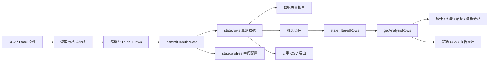

# Smart Tabular Analyzer 架构说明

本文面向维护者，内容以当前 V2.1 的 `index.html`、`script.js` 和测试代码为准。

## 1. 架构概览

项目是无构建步骤的纯静态应用：

- `index.html` 提供页面结构并通过 CDN 加载 PapaParse、Chart.js 和 SheetJS。
- `style.css` 提供桌面端与移动端样式。
- `script.js` 包含状态、导入、识别、筛选、分析、渲染和导出逻辑。
- 用户文件只在浏览器内读取和处理，不经过后端。



## 2. 文件结构

```text
.
├── index.html                  # 页面结构、控件和 CDN 引用
├── style.css                   # 页面样式与响应式规则
├── script.js                   # 全部浏览器端业务逻辑
├── package.json                # Node 测试命令
├── sample-*.csv                # 手工测试用虚构数据
├── assets/                     # README 截图
├── tests/
│   ├── test-context.cjs        # VM + 轻量假 DOM 测试环境
│   ├── data-processing.test.cjs
│   ├── basic-data-processing.test.cjs
│   ├── destructive-qa.test.cjs
│   ├── core.test.cjs
│   └── fixtures/               # 手工回归夹具
├── docs/                       # 开发者维护文档
└── .github/workflows/ci.yml    # push / PR 自动回归测试
```

## 3. 核心数据流

1. 文件选择或拖放触发 `parseDataFile()`。
2. CSV 进入 `parseCsvFile()`；Excel 进入 `parseExcelFile()`。
3. 两种格式最终都产出 `fields` 和 `rows`，并调用 `commitTabularData()`。
4. `commitTabularData()` 建立字段画像、原始质量统计和初始分析结果，然后渲染页面。
5. 筛选只创建新的 `filteredRows`，不会重写 `rows`。
6. 普通分析统一通过 `getAnalysisRows()` 获取当前数据范围。
7. 数据质量报告继续使用原始 `rows` 和 `qualityNumericStats`。
8. 图表、模板分析、结论和报告导出使用当前已提交的字段类型与筛选范围。

## 4. `state` 状态

`state` 是当前唯一的应用级可变状态。主要字段如下：

| 字段 | 含义 |
| --- | --- |
| `rows` | 导入后的完整原始记录。筛选和去重不得修改它。 |
| `filteredRows` | 当前筛选结果；未筛选时是 `rows.slice()`。 |
| `filterSourceRows` | 标记 `filteredRows` 是否由当前 `rows` 生成；`getAnalysisRows()` 会检查对象身份。 |
| `fields` | 原始字段顺序，预览、重复判断和 CSV 导出都依赖它。 |
| `profiles` | 每列的识别结果、缺失率、唯一值比例、日期策略、数值格式和当前类型。 |
| `fieldTypeDrafts` | 尚未应用的字段类型选择。草稿存在时报告导出会被禁用。 |
| `numericStats` | 基于当前分析行的数值统计。 |
| `qualityNumericStats` | 基于原始 `rows` 的数值统计，用于质量报告。 |
| `categoryStats` | 基于当前分析行的分类 Top 10。 |
| `duplicateRows` / `totalMissing` | 导入时基于原始数据计算的质量指标。 |
| `filters` | 当前分类、数值和日期筛选条件。每种类型最多一个字段。 |
| `categoryFilterOptions` / `categoryFilterDraftValues` | 分类筛选的候选值和未提交选择。 |
| `pendingExcel` | 多工作表 Excel 等待用户选择时保存的工作簿和导入 ID。 |
| `activeImportId` / `activeFileReader` | 隔离连续上传任务，并取消仍在进行的文件读取。 |
| `charts` | 以 canvas ID 为键保存 Chart.js 实例。 |
| `sourceFileName` / `sourceSheetName` / `sourceType` | 当前数据来源元信息。 |
| `analysisCompletedAt` | 分析完成标记；HTML/Markdown 报告导出依赖它。 |
| `insights` / `customAnalysis` | 当前自动结论和 V2 自定义分析快照。 |

重要约束：

- `rows` 是原始数据事实来源，筛选只更新 `filteredRows`。
- 分析代码优先调用 `getAnalysisRows()`，质量代码明确使用 `state.rows`。
- 新上传必须经过 `beginImport()`，以清空旧状态并使旧异步回调失效。
- 字段类型修正会重算分析并清除筛选，避免旧筛选与新类型不一致。

## 5. CSV 解析流程

1. `parseDataFile()` 检查扩展名和 25 MB 文件上限。
2. `beginImport()` 增加导入 ID、取消旧 `FileReader` 并重置分析状态。
3. 文件以 `ArrayBuffer` 读取。
4. `decodeCsvBuffer()` 根据编码选择解码：
   - 自动识别先检查 UTF-8 BOM，再严格尝试 UTF-8，失败后回退 GB18030。
   - 手动模式支持 UTF-8、GBK 和 GB18030。
5. `parseCsvText()` 使用 PapaParse，配置为表头模式、跳过空行、最多预读 100,001 行，并在支持时启用 Worker。
6. 表头先编码为唯一内部键，解析后再还原，以便项目自行检查空表头和重复表头。
7. `handleParsedData()` 检查多余单元格、引号/分隔符错误、行列上限、空数据和重复字段。
8. 有效数据规范为无原型行对象，再交给 `commitTabularData()`。

CSV 的最大数据规模为 100,000 行、200 列。PapaParse 的非致命问题最多保留 20 条到 `parseWarnings`。

## 6. Excel 解析流程

1. `parseExcelFile()` 检查文件大小并读取 `ArrayBuffer`。
2. `validateExcelFileSignature()` 检查 `.xlsx` 的 ZIP 签名或 `.xls` 的 OLE 签名。
3. SheetJS 以 `cellDates: true` 读取工作簿。
4. 单工作表直接分析；多工作表保存到 `pendingExcel`，等待用户选择。
5. `validateExcelWorksheetLimits()` 根据 `!ref` 提前检查 100,000 行和 200 列上限。
6. `sheet_to_json()` 以二维数组、`raw: true`、保留空值的方式读取工作表。
7. `buildExcelTabularData()` 去除首尾空行，并要求第一个非空行为唯一、非空的文本表头。
8. 数值使用工作簿原始值；Date 对象规范为 `YYYY-MM-DD`；空数据行被忽略。
9. 结果进入 `commitTabularData()`。

## 7. 字段识别

`buildColumnProfile()` 基于非缺失值计算：

- 缺失数量和缺失率。
- 唯一值数量和唯一值比例。
- 可转换数值比例和日期比例。
- 数值格式（普通数值或全百分比）。
- 日期顺序策略及转换失败数量。

默认识别顺序：

1. 字段名符合 ID 语义，或高唯一值文本列满足 ID 启发式规则时，识别为 `id`。
2. 日期转换成功率达到 80% 时，识别为 `date`。
3. 数值转换成功率达到 80% 时，识别为 `numeric`。
4. 其他字段识别为 `category`。

用户可改为 `numeric`、`category`、`date`、`id` 或 `ignore`。修正只改变 `profile.typeKey`，不会改写原始单元格；无法转换的非空值会从对应统计和图表中跳过。

## 8. 筛选

当前支持同时应用以下三个条件，条件之间使用 AND：

- 一个分类字段，允许选择多个类别值。
- 一个数值字段，范围包含最小值和最大值边界。
- 一个日期字段，范围包含开始和结束日期。

`applyFilters()` 从控件读取条件，调用 `filterRowsByConfig(state.rows, filters)` 生成新数组，并由 `refreshFilteredAnalysis()` 刷新预览、统计、图表、自定义分析、模板结果和结论。

筛选不会重新计算或覆盖原始缺失、重复和异常值质量信息。`clearAllFilters()` 使用 `rows.slice()` 恢复完整数据范围。

## 9. 分析

- 数值统计：有效值数量、平均值、中位数、最小值、最大值、总体标准差、Q1、Q3 和 IQR 异常值。
- 分类统计：忽略缺失值，按频数排序并保留 Top 10，同时计算非缺失值占比。
- 自动结论：描述当前数据范围、缺失/重复、一个代表性数值字段、首个有效分类字段和日期趋势，不推断业务原因。
- 基础自定义图表：数值字段按分类字段进行求和、平均值或中位数聚合。
- V2 自定义分析：选择指标、分组、聚合方式和可选日期，生成分组表、求和/平均表、Top 10 和趋势。
- 场景模板：通用、销售、成绩、二手商品、问卷和用户行为。模板只使用用户映射的字段。

## 10. 图表

Chart.js 图表实例统一保存在 `state.charts`：

- 数值字段使用 10 个区间的分布柱状图。
- 分类字段使用 Top 10 柱状图。
- 日期字段使用按时间分桶的折线趋势图。
- 自定义分析和模板生成额外柱状图/趋势图。

每个渲染函数在创建新实例前必须调用 `destroyChart(id)`。上传新文件时 `resetAnalysisState()` 会销毁全部实例。缺少字段、无有效值或 CDN 加载失败时，canvas 显示空状态，不创建 Chart 实例。

## 11. 导出

### 数据 CSV

- 筛选导出使用 `getAnalysisRows()`。
- 去重导出对原始 `rows` 和完整 `fields` 调用 `deduplicateRows()`，保留首次出现的完全重复行。
- `buildCsvExportContent()` 保留字段顺序，并用 PapaParse `unparse()` 生成 CRLF CSV。
- 可能触发电子表格公式的文本会增加单引号前缀。
- `downloadUtf8TextFile()` 为文件添加 UTF-8 BOM，并通过临时 Object URL 下载。

### 分析报告

- HTML 和 Markdown 共用 `buildReportData()` 生成的快照。
- HTML 报告内嵌当前可见 Chart.js 图表的 PNG Data URL，不依赖外部脚本。
- HTML 内容经过 `escapeHtml()`；Markdown 内容经过对应转义函数。
- 存在未应用字段类型草稿或分析尚未完成时，报告导出被禁用。

